# Water Billing System Flowchart

This flowchart reflects the current Django implementation in:

- `waterbilling_project/urls.py`
- `billing/urls.py`
- `billing/views.py`
- `billing/services.py`
- `billing/models.py`
- `billing/permissions.py`

```mermaid
flowchart TD
    Browser["User Browser"] --> RootRouter["Django Root Router<br/>waterbilling_project/urls.py"]
    RootRouter --> BillingRouter["billing.urls"]
    BillingRouter --> BillingViews["billing.views"]

    BillingViews --> Public["home() / signup_view() / RoleBasedLoginView / logout_view()"]
    Public --> Dashboard["dashboard()"]
    Dashboard --> RoleResolver{"get_user_role()<br/>ConsumerProfile"}

    RoleResolver --> AdminPanel["admin_panel()<br/>admin_panel_data()"]
    RoleResolver --> SecretaryPanel["secretary_panel()<br/>secretary_panel_data()"]
    RoleResolver --> TreasurerPanel["treasurer_panel()<br/>treasurer_panel_data()"]
    RoleResolver --> ReaderPanel["reader_panel()<br/>reader_panel_data()"]
    RoleResolver --> ConsumerPanel["consumer_panel()<br/>consumer_panel_data()<br/>account_center()"]

    subgraph DataLayer["Core Data Layer"]
        AuthUser["auth.User"]
        Profile["ConsumerProfile"]
        Consumer["Consumer"]
        Reading["MeterReading"]
        Billing["BillingRecord"]
        Payment["Payment"]
        Settings["SystemSettings"]
        Notification["Notification"]
        SMSBlast["SMSBlast"]
        Audit["AuditLog"]
        DB[("MySQL / SQLite-backed Django database")]

        AuthUser --> Profile
        Profile --> Consumer
        Consumer --> Reading
        Consumer --> Billing
        Consumer --> Payment
        Billing --> Payment
        Consumer --> Notification
        Reading --> Notification
        Billing --> Notification
        Payment --> Notification

        AuthUser --> DB
        Profile --> DB
        Consumer --> DB
        Reading --> DB
        Billing --> DB
        Payment --> DB
        Settings --> DB
        Notification --> DB
        SMSBlast --> DB
        Audit --> DB
    end

    subgraph RoleAndNav["Role / Access Layer"]
        EnsureProfile["ensure_user_profile()"]
        GetRole["get_user_role()"]
        GetDashboard["get_dashboard_route()<br/>get_dashboard_url_for_user()"]
        NavItems["build_navigation_items()"]
        Guards["role_required()"]
    end

    Public --> EnsureProfile
    EnsureProfile --> GetRole
    GetRole --> GetDashboard
    GetRole --> NavItems
    Guards --> BillingViews

    subgraph ReaderFlow["Reader / Meter Reading Flow"]
        ReaderSubmit["submit_reader_reading()"]
        ReaderEdit["update_reader_reading()"]
        ReaderContext["reader_reading_context()"]
        ReaderService["handle_meter_reading_submission()"]
        PreviousReading["get_previous_reading_details()"]
        BillingSync["create_or_update_billing_from_reading()"]
        ReaderPayload["reader_panel_data()<br/>_render_reader_live_payload()"]
        ReadingAlerts["notify_roles() + notify_consumer()"]
    end

    ReaderPanel --> ReaderSubmit
    ReaderPanel --> ReaderEdit
    ReaderPanel --> ReaderContext
    ReaderPanel --> ReaderPayload
    AdminPanel --> ReaderSubmit
    AdminPanel --> ReaderEdit

    ReaderSubmit --> ReaderService
    ReaderEdit --> PreviousReading
    ReaderService --> Reading
    ReaderService --> BillingSync
    PreviousReading --> ReaderEdit
    BillingSync --> Billing
    ReaderService --> ReadingAlerts
    ReaderEdit --> BillingSync
    ReadingAlerts --> Notification

    subgraph ConsumerPaymentFlow["Consumer Online Payment Flow"]
        ConsumerCheckout["consumer_panel() POST"]
        ConsumerForm["ConsumerPaymentForm"]
        PayMongoStart["create_paymongo_ewallet_payment()"]
        PayMongoStoreStart["_store_paymongo_gateway_start()"]
        PayMongoSuccess["paymongo_success()"]
        PayMongoVerify["paymongo_verify()"]
        PayMongoCancel["paymongo_cancel()"]
        PayMongoFetch["retrieve_paymongo_payment_intent()"]
        PayMongoPaid{"paymongo_intent_is_paid()?"}
        PayMongoStoreResult["_store_paymongo_gateway_result()"]
        PaymentStatusUpdate["update_payment_status()"]
        PaymentNotice["send_payment_notification()"]
        Receipt["payment_receipt_view()"]
        StartedNotice["notify_roles()<br/>New online payment started"]
    end

    ConsumerPanel --> ConsumerCheckout
    ConsumerCheckout --> ConsumerForm
    ConsumerForm --> Payment
    ConsumerCheckout --> PayMongoStart
    PayMongoStart --> PayMongoStoreStart
    PayMongoStoreStart --> Payment
    ConsumerCheckout --> StartedNotice
    StartedNotice --> Notification
    PayMongoSuccess --> PayMongoVerify
    PayMongoVerify --> PayMongoFetch
    PayMongoFetch --> PayMongoPaid
    PayMongoPaid -->|Yes| PayMongoStoreResult
    PayMongoPaid -->|No / Failed| PayMongoStoreResult
    PayMongoStoreResult --> PaymentStatusUpdate
    PaymentStatusUpdate --> Payment
    PaymentStatusUpdate --> Billing
    PaymentStatusUpdate --> PaymentNotice
    PaymentNotice --> Notification
    ConsumerPanel --> Receipt

    subgraph StaffPaymentFlow["Staff Payment and Status Flow"]
        PaymentsList["payments_list()"]
        AdminPayment["AdminPaymentForm"]
        ManualPaymentNotice["send_payment_notification()"]
        StatusAjax["update_payment_status_view()"]
        StatusNotify["notify_payment_status()"]
        StatusPayload["_payment_status_payload()"]
        PaymentAudit["log_audit_action()"]
    end

    AdminPanel --> PaymentsList
    TreasurerPanel --> PaymentsList
    SecretaryPanel --> PaymentsList
    PaymentsList --> AdminPayment
    AdminPayment --> Payment
    AdminPayment --> Billing
    AdminPayment --> ManualPaymentNotice
    ManualPaymentNotice --> Notification
    PaymentsList --> PaymentAudit
    StatusAjax --> PaymentStatusUpdate
    StatusAjax --> StatusPayload
    StatusAjax --> PaymentAudit
    StatusAjax --> ReadingAlerts
    StatusNotify --> PaymentNotice

    subgraph BillingFlow["Billing Flow"]
        ConsumersList["consumer_list()"]
        AddConsumer["add_consumer()"]
        EditConsumer["edit_consumer()"]
        BillingList["billing_list()"]
        AddBilling["add_billing()"]
        DueNotice["send_billing_due_notification()"]
        SettingsPage["payment_settings_view()"]
        BillingRecalc["sync_existing_billings_with_settings()"]
    end

    AdminPanel --> ConsumersList
    AdminPanel --> AddConsumer
    AdminPanel --> EditConsumer
    AdminPanel --> BillingList
    SecretaryPanel --> BillingList
    TreasurerPanel --> BillingList
    AdminPanel --> AddBilling
    AddConsumer --> Consumer
    EditConsumer --> Consumer
    AddBilling --> Billing
    AddBilling --> DueNotice
    DueNotice --> Notification
    AdminPanel --> SettingsPage
    SettingsPage --> Settings
    SettingsPage --> BillingRecalc
    BillingRecalc --> Billing
    SettingsPage --> Audit

    subgraph ReportsAndComms["Reports / Communications"]
        Reports["reports_view()"]
        ReportsExport["reports_export_view()"]
        SOAContext["_build_monthly_statement_context()<br/>_build_soa_transactions()<br/>_build_soa_summary()"]
        SOAPdf["_build_soa_pdf()"]
        Communications["communications_view()"]
        SMSService["send_sms_blast()"]
        EmailService["send_email_blast()"]
        TestSMS["send_test_sms()"]
        TestEmail["send_test_email()"]
        DeliveryConfig["get_delivery_configuration_summary()"]
    end

    AdminPanel --> Reports
    SecretaryPanel --> Reports
    TreasurerPanel --> Reports
    Reports --> SOAContext
    ReportsExport --> SOAPdf
    SOAPdf --> Audit

    AdminPanel --> Communications
    SecretaryPanel --> Communications
    Communications --> SMSService
    Communications --> EmailService
    Communications --> TestSMS
    Communications --> TestEmail
    Communications --> DeliveryConfig
    SMSService --> SMSBlast
    SMSService --> Notification
    EmailService --> Notification
    TestSMS --> Notification
    TestEmail --> Notification
    Communications --> Audit

    subgraph ProfileAndNotifications["Profile / Notification Flow"]
        ProfilePage["profile_view()"]
        ProfileUpdate["update_profile_view()"]
        ProfilePayload["_render_profile_response_payload()"]
        NotificationPage["notifications_view()"]
        ProfileAudit["log_audit_action()<br/>for secretary / treasurer updates"]
    end

    AdminPanel --> ProfilePage
    SecretaryPanel --> ProfilePage
    TreasurerPanel --> ProfilePage
    ReaderPanel --> ProfilePage
    ConsumerPanel --> ProfilePage
    ProfilePage --> ProfileUpdate
    ProfileUpdate --> Profile
    ProfileUpdate --> ProfilePayload
    ProfileUpdate --> ProfileAudit
    ConsumerPanel --> NotificationPage
    NotificationPage --> Notification

    subgraph DeliveryLayer["Outbound Delivery / Provider Layer"]
        InApp["create_in_app_notification()"]
        NotifyRoles["notify_roles()"]
        NotifyConsumer["notify_consumer()"]
        EmailSend["send_email_notification()<br/>SMTP / SendGrid"]
        SMSSend["send_sms_notification()<br/>SMS API PH"]
        PayMongoAPI["PayMongo API"]
    end

    ReadingAlerts --> NotifyRoles
    ReadingAlerts --> NotifyConsumer
    DueNotice --> NotifyConsumer
    PaymentNotice --> NotifyConsumer
    NotifyRoles --> InApp
    NotifyConsumer --> InApp
    NotifyConsumer --> EmailSend
    NotifyConsumer --> SMSSend
    Communications --> EmailSend
    Communications --> SMSSend
    PayMongoStart --> PayMongoAPI
    PayMongoFetch --> PayMongoAPI
```

## Main System Flow

1. Users enter through `home`, `signup`, `login`, and `logout`, then `dashboard()` redirects them to the correct role panel using `ConsumerProfile`.
2. The role/access layer in `billing/permissions.py` controls routing, sidebar navigation, and page guards through `role_required()`.
3. Admin and reader users create or correct meter readings through `submit_reader_reading()` and `update_reader_reading()`, which save `MeterReading`, recalculate `BillingRecord`, and trigger notifications.
4. Consumers start PayMongo e-wallet payments from `consumer_panel()`, while admin and treasurer users can also record payments manually from `payments_list()`.
5. Payment updates flow through `update_payment_status()` so billing balances, billing status, gateway fields, and payment notifications stay synchronized.
6. Admin can manage consumers, add manual billings, and update `SystemSettings`; settings changes recalculate existing billing records system-wide.
7. Admin, secretary, and treasurer users access reports and statement-of-account PDF export through the reporting pipeline in `reports_view()` and `reports_export_view()`.
8. Admin and secretary users send SMS and email blasts through `communications_view()`, which logs outbound notifications and audit records.
9. All roles use `profile_view()` and `update_profile_view()`, while consumers also use `notifications_view()` and `account_center()`.
10. The delivery layer sends in-app, email, SMS, and PayMongo-linked status updates through `billing/services.py`.

## Key Runtime Notes

- The reader, consumer, secretary, treasurer, and admin dashboards each have dedicated live-data endpoints for partial page refreshes.
- `Payment.save()` recalculates the linked billing's paid amount from completed payments.
- `BillingRecord.save()` recalculates usage, total amount, and overdue / paid / pending status automatically.
- `MeterReading.save()` locks each reading to one record per `consumer + billing_month`.
- Notifications are stored even when external delivery fails, so the system still keeps an audit trail of attempted sends.
