# Tabuan Water Billing System Flowchart

This document reflects the current Django implementation in:

- `waterbilling_project/urls.py`
- `billing/urls.py`
- `billing/views.py`
- `billing/services.py`
- `billing/models.py`
- `billing/permissions.py`

```mermaid
flowchart TD
    Browser["User Browser"] --> RootRouter["Django Root Router<br/>waterbilling_project/urls.py"]
    RootRouter --> AuthRoutes["Password reset / password change routes"]
    RootRouter --> BillingRouter["billing.urls"]
    BillingRouter --> BillingViews["billing.views"]

    subgraph PublicAccess["Public Access and Authentication"]
        Home["home()"]
        Signup["signup_view()"]
        Login["RoleBasedLoginView"]
        GoogleStart["google_login_start()"]
        GoogleCallback["google_login_callback()"]
        Logout["logout_view()"]
        ChangeReq["password_change_request_view()"]
        ChangeVerify["password_change_verify_view()"]
        ChangeDone["password_change_done_view()"]
        ResetFlow["PasswordResetView / Confirm / Complete"]
        Dashboard["dashboard()"]
        RoleResolver{"get_user_role()<br/>ConsumerProfile"}
    end

    BillingViews --> Home
    BillingViews --> Signup
    BillingViews --> Login
    BillingViews --> GoogleStart
    BillingViews --> GoogleCallback
    BillingViews --> Logout
    BillingViews --> Dashboard
    BillingViews --> ChangeReq
    BillingViews --> ChangeVerify
    BillingViews --> ChangeDone
    AuthRoutes --> ResetFlow

    Login --> Dashboard
    GoogleStart --> GoogleCallback
    GoogleCallback --> Dashboard
    ChangeReq --> ChangeVerify
    ChangeVerify --> ChangeDone
    Dashboard --> RoleResolver

    subgraph RoleAccess["Role and Navigation Layer"]
        EnsureProfile["ensure_user_profile()"]
        GetRole["get_user_role()"]
        GetDashboard["get_dashboard_route()<br/>get_dashboard_url_for_user()"]
        LinkedConsumer["get_linked_consumer()"]
        NavItems["build_navigation_items()"]
        Guards["role_required()"]
    end

    Login --> EnsureProfile
    GoogleCallback --> EnsureProfile
    EnsureProfile --> GetRole
    GetRole --> GetDashboard
    GetRole --> LinkedConsumer
    GetRole --> NavItems
    Guards --> BillingViews

    RoleResolver --> AdminPanel["admin_panel()<br/>admin_panel_data()"]
    RoleResolver --> SecretaryPanel["secretary_panel()<br/>secretary_panel_data()"]
    RoleResolver --> TreasurerPanel["treasurer_panel()<br/>treasurer_panel_data()"]
    RoleResolver --> ReaderPanel["reader_panel()<br/>reader_panel_data()"]
    RoleResolver --> ConsumerPanel["consumer_panel()<br/>consumer_panel_data()<br/>account_center()"]

    subgraph DataLayer["Core Data Layer"]
        AuthUser["auth.User"]
        Profile["ConsumerProfile"]
        Consumer["Consumer"]
        Settings["SystemSettings"]
        Reading["MeterReading"]
        Billing["BillingRecord"]
        Payment["Payment"]
        Notification["Notification"]
        SMSBlast["SMSBlast"]
        Audit["AuditLog"]
        Minutes["MeetingMinutes"]
        MinuteRevision["MeetingMinutesRevision"]
        DB[("SQLite / MySQL-backed Django database")]

        AuthUser --> Profile
        Profile --> Consumer
        Consumer --> Reading
        Consumer --> Billing
        Consumer --> Payment
        Billing --> Payment
        Consumer --> Notification
        Reading --> Notification
        Billing --> Notification
        Payment --> Notification
        AuthUser --> Minutes
        Minutes --> MinuteRevision

        AuthUser --> DB
        Profile --> DB
        Consumer --> DB
        Settings --> DB
        Reading --> DB
        Billing --> DB
        Payment --> DB
        Notification --> DB
        SMSBlast --> DB
        Audit --> DB
        Minutes --> DB
        MinuteRevision --> DB
    end

    subgraph ConsumerIdentity["Consumer Signup and Google Access"]
        ConsumerRegister["signup_view() creates User + ConsumerProfile"]
        GoogleExchange["Exchange OAuth code with Google"]
        GoogleProfile["Fetch Google profile"]
        GoogleConsumer["Create/update consumer-only User + ConsumerProfile + Consumer"]
        StaffConflict{"Email already tied<br/>to staff account?"}
    end

    Signup --> ConsumerRegister
    ConsumerRegister --> AuthUser
    ConsumerRegister --> Profile
    GoogleCallback --> GoogleExchange
    GoogleExchange --> GoogleProfile
    GoogleProfile --> StaffConflict
    StaffConflict -->|No| GoogleConsumer
    StaffConflict -->|Yes| Login
    GoogleConsumer --> AuthUser
    GoogleConsumer --> Profile
    GoogleConsumer --> Consumer

    subgraph ReaderFlow["Meter Reading and Billing Sync"]
        ReaderSubmit["submit_reader_reading()"]
        ReaderEdit["update_reader_reading()"]
        ReaderContext["reader_reading_context()"]
        ReaderService["handle_meter_reading_submission()"]
        PreviousReading["get_previous_reading_details()"]
        BillingSync["create_or_update_billing_from_reading()"]
        AdvanceSync["_sync_advance_payments_to_billing()"]
        ReaderPayload["_render_reader_live_payload()"]
        ReadingAlerts["notify_roles() + notify_consumer()"]
    end

    ReaderPanel --> ReaderSubmit
    ReaderPanel --> ReaderEdit
    ReaderPanel --> ReaderContext
    ReaderPanel --> ReaderPayload
    AdminPanel --> ReaderSubmit
    AdminPanel --> ReaderEdit

    ReaderSubmit --> ReaderService
    ReaderEdit --> PreviousReading
    ReaderService --> Reading
    ReaderService --> BillingSync
    ReaderEdit --> BillingSync
    BillingSync --> AdvanceSync
    AdvanceSync --> Billing
    ReaderService --> ReadingAlerts
    ReaderEdit --> ReadingAlerts
    ReadingAlerts --> Notification

    subgraph BillingOperations["Consumer, Billing, and Settings Operations"]
        ConsumersList["consumer_list()"]
        AddConsumer["add_consumer()"]
        EditConsumer["edit_consumer()"]
        BillingList["billing_list()"]
        AddBilling["add_billing()"]
        DueNotice["send_billing_due_notification()"]
        SettingsPage["payment_settings_view()"]
        SettingsRecalc["sync_existing_billings_with_settings()"]
    end

    AdminPanel --> ConsumersList
    AdminPanel --> AddConsumer
    AdminPanel --> EditConsumer
    AdminPanel --> BillingList
    SecretaryPanel --> BillingList
    TreasurerPanel --> BillingList
    AdminPanel --> AddBilling
    AddConsumer --> Consumer
    AddConsumer --> Profile
    EditConsumer --> Consumer
    AddBilling --> Billing
    AddBilling --> DueNotice
    DueNotice --> Notification
    AdminPanel --> SettingsPage
    SettingsPage --> Settings
    SettingsPage --> SettingsRecalc
    SettingsRecalc --> Billing
    SettingsPage --> Audit

    subgraph PaymentFlow["Payment Processing and Verification"]
        PaymentsList["payments_list()"]
        PaymentStatusAjax["update_payment_status_view()"]
        PaymentNotify["notify_payment_status()"]
        PaymentStatusLogic["update_payment_status()"]
        PaymentReceipt["payment_receipt_view()"]
        ConsumerCheckout["consumer_panel() payment POST"]
        PayMongoStart["Create PayMongo payment source"]
        PayMongoSuccess["paymongo_success()"]
        PayMongoVerify["paymongo_verify()"]
        PayMongoCancel["paymongo_cancel()"]
        GatewayFetch["Retrieve gateway status"]
        PaymentNotice["send_payment_notification()"]
    end

    AdminPanel --> PaymentsList
    TreasurerPanel --> PaymentsList
    SecretaryPanel --> PaymentsList
    PaymentsList --> Payment
    PaymentsList --> PaymentStatusAjax
    PaymentStatusAjax --> PaymentStatusLogic
    PaymentStatusLogic --> Payment
    PaymentStatusLogic --> Billing
    PaymentStatusLogic --> PaymentNotice
    PaymentNotice --> Notification
    PaymentNotify --> PaymentNotice

    ConsumerPanel --> ConsumerCheckout
    ConsumerCheckout --> Payment
    ConsumerCheckout --> PayMongoStart
    PayMongoStart --> PayMongoSuccess
    PayMongoSuccess --> PayMongoVerify
    PayMongoVerify --> GatewayFetch
    GatewayFetch --> PaymentStatusLogic
    ConsumerPanel --> PaymentReceipt
    PayMongoCancel --> Payment

    subgraph SecretaryMinutes["Secretary Meeting Minutes Lifecycle"]
        MinutesContext["_build_secretary_minutes_context()"]
        MinutesCreate["Create or save draft minutes"]
        MinutesDetail["secretary_meeting_minutes_detail()"]
        MinutesRev["record_revision()"]
        MinutesApprove["Approve and lock minutes"]
        MinutesPDF["secretary_meeting_minutes_export_pdf()"]
        MinutesLogo["PDF / preview branding with system logo"]
    end

    SecretaryPanel --> MinutesContext
    SecretaryPanel --> MinutesCreate
    SecretaryPanel --> MinutesDetail
    SecretaryPanel --> MinutesApprove
    SecretaryPanel --> MinutesPDF
    MinutesCreate --> Minutes
    MinutesCreate --> MinutesRev
    MinutesDetail --> Minutes
    MinutesApprove --> Minutes
    MinutesApprove --> MinuteRevision
    MinutesPDF --> MinutesLogo
    MinutesPDF --> Minutes

    subgraph AdminMonitoring["Admin Monitoring and Oversight"]
        AdminMinutesSnapshot["_build_meeting_minutes_admin_snapshot()"]
        AdminMinutesUI["Meeting Minutes Oversight in admin dashboard"]
        DjangoAdmin["Django admin registrations<br/>MeetingMinutes + MeetingMinutesRevision"]
    end

    AdminPanel --> AdminMinutesSnapshot
    AdminMinutesSnapshot --> AdminMinutesUI
    AdminMinutesSnapshot --> Minutes
    AdminMinutesSnapshot --> MinuteRevision
    DjangoAdmin --> Minutes
    DjangoAdmin --> MinuteRevision

    subgraph ReportsAndComms["Reports, Statements, and Communications"]
        Reports["reports_view()"]
        ReportsExport["reports_export_view()"]
        SOABuild["SOA summary + PDF builders"]
        Communications["communications_view()"]
        SMSService["send_sms_blast()"]
        EmailService["send_email_blast()"]
        DeliverySummary["get_delivery_configuration_summary()"]
        NotificationLog["Outbound notification log"]
    end

    AdminPanel --> Reports
    SecretaryPanel --> Reports
    TreasurerPanel --> Reports
    Reports --> ReportsExport
    ReportsExport --> SOABuild
    SOABuild --> Audit

    AdminPanel --> Communications
    SecretaryPanel --> Communications
    Communications --> SMSService
    Communications --> EmailService
    Communications --> DeliverySummary
    Communications --> NotificationLog
    SMSService --> SMSBlast
    SMSService --> Notification
    EmailService --> Notification
    Communications --> Audit

    subgraph ProfileAndAlerts["Profile, Notifications, and Security OTP"]
        ProfilePage["profile_view()"]
        ProfileUpdate["update_profile_view()"]
        NotificationsPage["notifications_view()"]
        OTPDispatch["send_user_security_otp()"]
        OTPCache["OTP token in cache/session"]
    end

    AdminPanel --> ProfilePage
    SecretaryPanel --> ProfilePage
    TreasurerPanel --> ProfilePage
    ReaderPanel --> ProfilePage
    ConsumerPanel --> ProfilePage
    ProfilePage --> ProfileUpdate
    ProfileUpdate --> Profile
    ProfileUpdate --> Audit
    ConsumerPanel --> NotificationsPage
    NotificationsPage --> Notification
    ChangeReq --> OTPDispatch
    OTPDispatch --> Notification
    OTPDispatch --> OTPCache
    OTPCache --> ChangeVerify

    subgraph ExternalProviders["External Provider Integrations"]
        GoogleOAuth["Google OAuth 2.0"]
        PayMongoAPI["PayMongo API"]
        EmailProvider["SMTP / SendGrid"]
        SMSProvider["SMS API PH / Twilio"]
    end

    GoogleExchange --> GoogleOAuth
    PayMongoStart --> PayMongoAPI
    GatewayFetch --> PayMongoAPI
    EmailService --> EmailProvider
    PaymentNotice --> EmailProvider
    DueNotice --> EmailProvider
    ReadingAlerts --> EmailProvider
    SMSService --> SMSProvider
    PaymentNotice --> SMSProvider
    DueNotice --> SMSProvider
    ReadingAlerts --> SMSProvider
```

## Main System Flow

1. Users enter through the public pages at `/`, `/signup/`, `/login/`, Google consumer login, password reset, or the OTP-based password change flow.
2. After authentication, `dashboard()` resolves the user role from `ConsumerProfile` and redirects to the correct dashboard: admin, secretary, treasurer, reader, or consumer.
3. Reader and admin users submit or update meter readings, which create or update `MeterReading`, synchronize the matching `BillingRecord`, and notify both staff and the linked consumer.
4. Admin users manage consumers, create billing records, update payment settings, and trigger recalculation of existing billing records when rates or due-day rules change.
5. Consumers can review accounts, receive notifications, and initiate online payment flows, while admin, treasurer, and secretary users can manage payment records and status updates from the staff side.
6. Secretaries maintain structured meeting minutes with draft editing, revision snapshots, approval locking, and PDF export, while admins monitor the resulting minutes and revision activity from the admin dashboard and Django admin.
7. Reports, statement-of-account export, communications blasts, and outbound notification history operate as cross-cutting office tools for staff roles.

## Role Summary

- `Admin`: full operational access, consumer management, billing, payments, meter reading access, reports, communications, settings, and meeting-minutes oversight.
- `Secretary`: dashboard, billing, payments, reports, communications, and exclusive edit ownership of their meeting minutes before approval.
- `Treasurer`: dashboard, billing, payments, and reports.
- `Reader`: dashboard, meter reading entry and correction, and profile access.
- `Consumer`: account center, notifications, online payment initiation, profile access, and optional Google-based sign-in.

## Key Runtime Notes

- `ConsumerProfile` is the central role-mapping record used for dashboard routing, sidebar composition, and permission checks.
- `BillingRecord.save()` recalculates usage totals, bill totals, and billing status automatically.
- `Payment.save()` recomputes the linked billing's total paid amount from completed payments.
- `MeterReading` enforces one reading per consumer per billing month.
- Meeting minutes remain editable only while in `draft` status; approval locks editing and preserves revision history.
- Notifications are stored in-app even when external email or SMS delivery fails, so outbound attempts remain visible in the communications log.
