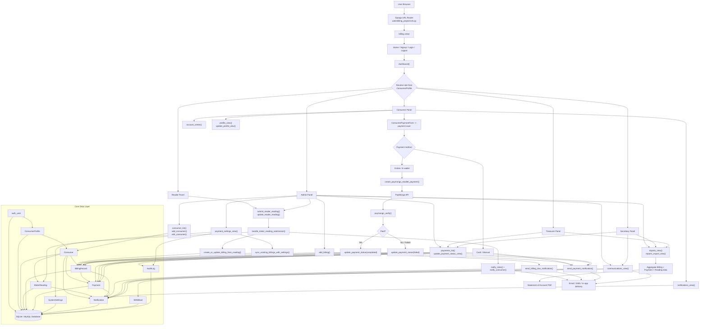

# Water Billing System Flowchart

This flowchart is based on the current Django codebase in `billing/`, `templates/`, and `waterbilling_project/`.

## Main System Flow

1. Users authenticate and are redirected to a role-based dashboard.
2. Admin and reader accounts submit meter readings.
3. Meter readings create or update billing records using `SystemSettings`.
4. Consumers or staff create payments.
5. Payment saves refresh billing balances and statuses.
6. Notifications are sent through in-app records and optional email/SMS providers.
7. Admin, secretary, and treasurer dashboards read aggregated billing, payment, and meter data for reports.
